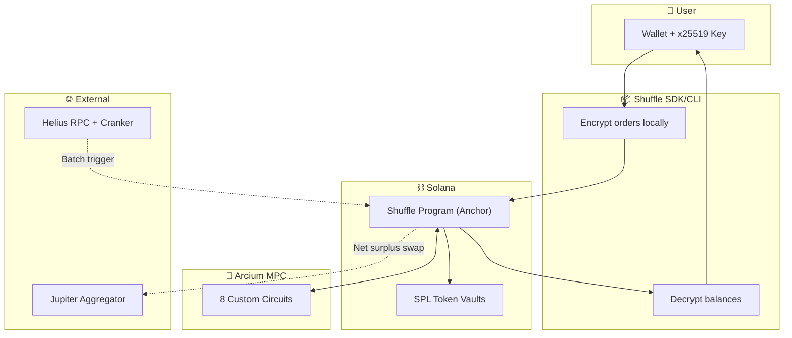

```
███████╗██╗  ██╗██╗   ██╗███████╗███████╗██╗     ███████╗
██╔════╝██║  ██║██║   ██║██╔════╝██╔════╝██║     ██╔════╝
███████╗███████║██║   ██║█████╗  █████╗  ██║     █████╗  
╚════██║██╔══██║██║   ██║██╔══╝  ██╔══╝  ██║     ██╔══╝  
███████║██║  ██║╚██████╔╝██║     ██║     ███████╗███████╗
╚══════╝╚═╝  ╚═╝ ╚═════╝ ╚═╝     ╚═╝     ╚══════╝╚══════╝
```

## 🛠️ Local Development Setup

Run Shuffle Protocol locally with Arcium MPC on a local Solana validator.

### Requirements

| Tool | Version | Installation |
|------|---------|--------------|
| **Node.js** | v18+ | [nodejs.org](https://nodejs.org/) |
| **Rust** | Latest | [rustup.rs](https://rustup.rs/) |
| **Solana CLI** | v1.18+ | [docs.solana.com](https://docs.solana.com/cli/install-solana-cli-tools) |
| **Anchor CLI** | v0.30+ | [anchor-lang.com](https://www.anchor-lang.com/docs/installation) |
| **Arcium CLI** | v0.6+ | [docs.arcium.com](https://docs.arcium.com/getting-started/installation) |
| **Docker** | Latest | [docker.com](https://docs.docker.com/get-docker/) |

### Quick Start

```bash
# 1. Verify environment (checks all requirements)
npm run check:env

# 2. Install all dependencies (contract + SDK)
npm run install:all

# 3. Start local environment (Solana + Arcium nodes)
npm run setup:local

# 4. Use the CLI (in another terminal) - see Testing Flow below

# 5. When done, cleanup
npm run clean
```

### Testing the Full Flow

After `npm run setup:local` completes, test the protocol in another terminal.

> **Note:** The setup already created 7 test users with orders. Your order will be the 8th, triggering batch execution!

```bash
# 1. Initialize your privacy account
shuffle init
# ✔ Privacy account created!

# 2. Get test USDC
shuffle faucet 1000
# ✔ Minted 1000 USDC to your wallet

# 3. Shield (deposit) tokens into privacy account
shuffle deposit USDC 500
# ✔ Deposited 500 USDC

# 4. Check your shielded balance
shuffle balance
# Token   🔒 Shielded   🔓 Unshielded
# USDC        500.00         500.00

# 5. Place an order (this is the 8th order - triggers batch!)
shuffle order
# ✔ Order placed! Batch 1, Position 8/8
# 🎉 Batch ready for execution!

# 6. Execute the batch (MPC computation in TEE)
shuffle execute
# ✔ Batch executed! Orders matched and settled.

# 7. Check balance (lazy settlement shows pending payout)
shuffle balance
# Token   🔒 Shielded   🔓 Unshielded
# USDC        400.00         500.00
# TSLA         10.00           0.00   ← Your filled order!

# 8. Settle to claim your payout
shuffle settle
# ✔ Settlement complete!

# 9. Continue trading - place more orders
shuffle order
```

> **Multi-user testing:** Create additional users with `--user`:
> ```bash
> shuffle --user alice airdrop 2   # Get SOL first
> shuffle --user alice init
> shuffle --user alice faucet 1000
> shuffle --user alice deposit USDC 500
> shuffle --user alice order
> ```

---
## 🎯 The Problem

**$1.5B+ extracted by MEV bots on Solana annually.** Every trade signals your intentions to the entire network. Bots frontrun you. Competitors see your accumulation strategy. Institutions can't place large orders without moving markets.

DeFi has a fundamental transparency problem.

---

## 💡 The Solution: Shuffle

Shuffle is the **first protocol** to bridge Privacy 2.0 encrypted computation with public DEX liquidity.

| Step | What Happens | Privacy |
|------|--------------|---------|
| **🛡️ Shield** | Deposit SPL tokens into encrypted balances | Only you can see your balance |
| **🔄 Trade** | Place encrypted orders (pair, direction, amount all hidden) | Orders aggregate privately |
| **💰 Settle** | Automatic pro-rata payouts on next interaction | Settlement amounts encrypted |

**No tradeoffs.** Privacy AND best price via Jupiter's $4B+ liquidity.

---

## 🏗️ Architecture



For technical deep-dive, see:
- [Privacy 2.0 Concept](docs/TECHNICAL_OVERVIEW.md#privacy-20-the-missing-piece)
- [Omni-Batch Innovation](docs/TECHNICAL_OVERVIEW.md#technical-innovation-omni-batch)
- [MPC Circuit Reference](docs/TECHNICAL_OVERVIEW.md#mpc-circuit-reference)

---

## 🔌 Sponsor Integrations

### Arcium Track — MPC Encrypted Computation

We built **8 custom Arcis circuits** for on-chain encrypted computation:

| Circuit | Purpose | Code |
|---------|---------|------|
| `add_balance` | Deposit to encrypted balance | [encrypted-ixs/src/lib.rs](contract/encrypted-ixs/src/lib.rs) |
| `sub_balance` | Withdraw from encrypted balance | ↑ |
| `transfer` | Atomic P2P transfer | ↑ |
| `init_batch_state` | Create encrypted batch | ↑ |
| `accumulate_order` | Add order to batch, deduct from user | ↑ |
| `reveal_batch` | Decrypt aggregate totals for netting | ↑ |
| `calculate_payout` | Pro-rata settlement computation | ↑ |

**Key integration points:**
- MXE encrypted shared state (`Enc<Shared, T>` and `Enc<Mxe, T>`)
- Computation callbacks for async MPC results
- x25519 key exchange for user-side decryption

### Helius Track — Infrastructure

| Component | Integration |
|-----------|-------------|
| **RPC** | Devnet/Mainnet node access for all transactions |
| **Cranker** | Automated batch trigger when thresholds met (≥8 orders, ≥2 active pairs) |

### Solana Ecosystem

| Component | Integration |
|-----------|-------------|
| **Anchor 0.32** | Smart contract framework with PDAs |
| **SPL Tokens** | 4 assets: USDC, TSLA, SPY, AAPL |
| **Jupiter CPI** | Net surplus routing for best execution |

---

## 🚀 Quick Start

### CLI Installation

```bash
npm install -g @shuffle/cli
```

### Basic Usage

```bash
# Create your privacy account
shuffle init

# View encrypted balances (decrypts locally)
shuffle balance

# Deposit tokens into privacy account
shuffle deposit USDC 1000

# Place encrypted order
shuffle order TSLA_USDC buy 500

# Check order status
shuffle status

# Settle after batch execution
shuffle settle
```

### SDK Usage

```typescript
import { ShuffleClient, AssetId, PairId, Direction } from "@shuffle/cli";

// Initialize client
const client = await ShuffleClient.create({ connection, wallet });
client.initEncryption(yourX25519PrivateKey);

// Create privacy account
await client.createUserAccount();

// Deposit and trade
await client.deposit(AssetId.USDC, 1_000_000_000); // 1000 USDC
await client.placeOrder(PairId.TSLA_USDC, Direction.BtoA, 500_000_000);

// Check balance (decrypts all 4 assets)
const balances = await client.getBalance();
console.log("USDC:", balances.usdc);
```

---

## 🎬 Demo

<!-- TODO: Add demo video link -->
> 🎥 **Video Demo**: [[Link]](https://drive.google.com/file/d/1XJjiBkKVjA-4BHtwMCafhziieIOoUlX0/view)

---

## 🔒 What's Private vs Public

| Data | Encrypted? | Who Can See |
|------|------------|-------------|
| User balances | ✅ Yes | User only (decrypts locally) |
| Order pair/direction/amount | ✅ Yes | User only |
| Settlement payouts | ✅ Yes | User only |
| Account exists | ❌ No | Public |
| Batch order count | ❌ No | Public |
| Aggregate totals (post-batch) | ❌ No | Public |

We're surgical about privacy—see [Data Visibility Matrix](docs/TECHNICAL_OVERVIEW.md#encrypted-vs-non-encrypted-data).

---

## 👥 Team

|  |  |
|--|--|
| **Bulldozer** | [@BulldozerFi](https://x.com/BulldozerFi) — DeFi developer with neobank clients, mainnet deployments securing user funds, cybersecurity background |
| **Tothster** | [@itstothster](https://x.com/itstothster) — Experienced DeFi builder, mainnet dapps, cybersecurity foundations |

Built in a single hackathon sprint. 🚀

---

## 📁 Repository Structure

```
sol-privacy-mvp/
├── contract/               # Anchor + Arcium smart contract
│   ├── programs/           # Shuffle Program (Rust)
│   ├── encrypted-ixs/      # Arcis MPC circuits
│   └── tests/              # Integration tests
├── sdk/                    # TypeScript SDK + CLI
├── frontend/               # Next.js 14 app
├── faucet/                 # Test token faucet
└── docs/                   # Technical documentation
```


---

<p align="center">
  <strong>Private trading. Public liquidity. Best execution.</strong><br>
  Built with ❤️ on Solana using Arcium MPC + Helius
</p>
