# Shuffle Protocol: Technical Overview

> **Private Multi-Asset Trading on Solana with External Liquidity**
>
> *The first DeFi protocol to bridge Privacy 2.0 encrypted computation with public DEX liquidity, enabling private order aggregation without cold-start liquidity problems.*

---

## Table of Contents

1. [Executive Summary](#executive-summary)
2. [Privacy 2.0: The Missing Piece](#privacy-20-the-missing-piece)
3. [Shuffle Architecture](#shuffle-architecture)
4. [Core Features Deep-Dive](#core-features-deep-dive)
   - [Private SPL Token Shielding](#41-private-spl-token-shielding)
   - [Private Multi-Pair Trading](#42-private-multi-pair-trading)
   - [External Liquidity Integration](#43-external-liquidity-integration)
   - [Lazy Settlement Architecture](#44-lazy-settlement-architecture)
5. [Technical Innovation: Omni-Batch](#technical-innovation-omni-batch)
6. [Encrypted vs Non-Encrypted Data](#encrypted-vs-non-encrypted-data)
7. [SDK for Privacy Products](#sdk-for-privacy-products)
8. [MPC Circuit Reference](#mpc-circuit-reference)
9. [Use Case: Private Neobank for RWA Trading](#use-case-private-neobank-for-rwa-trading)

---

## Executive Summary

**Shuffle** is a privacy-preserving multi-asset trading protocol built on Solana using Arcium's Multi-Party Computation (MPC) layer. It enables:

- **Private SPL Token Management**: Shield any supported token with encrypted on-chain balances
- **Private Trading with Best Execution**: Place encrypted orders that aggregate into batches, then settle against external liquidity (Jupiter) instead of requiring bootstrapped internal pools
- **Zero UX Friction**: Lazy settlement architecture means users never need to manually claim—payouts apply on next interaction

### Key Differentiators

| Traditional Dark Pools | Shuffle |
|------------------------|---------|
| Require internal liquidity bootstrapping | Connects to Jupiter's $4B+ liquidity |
| Orders matched internally only | Net surplus routed to best external price |
| Privacy OR good execution | Privacy AND best execution |
| Isolated from DeFi ecosystem | Fully composable with Solana DeFi |

---

## Privacy 2.0: The Missing Piece

### The Evolution of Blockchain Privacy

Every major technology wave follows a pattern: **single-player → multi-player**.

```
┌─────────────────────────────────────────────────────────────────────────────┐
│              BLOCKCHAIN PRIVACY EVOLUTION                                    │
├─────────────┬──────────────────────┬────────────────────────────────────────┤
│   Era       │   What It Gave Us    │   Limitation                           │
├─────────────┼──────────────────────┼────────────────────────────────────────┤
│ Bitcoin     │ Public isolated state│ No privacy, no programmability         │
│ Ethereum    │ Public shared state  │ All state visible to everyone          │
│ Zcash       │ Encrypted isolated   │ Cannot coordinate privately            │
│ Privacy 2.0 │ ENCRYPTED SHARED     │ ← The missing quadrant                 │
└─────────────┴──────────────────────┴────────────────────────────────────────┘
```

### Privacy 1.0 vs Privacy 2.0

| Aspect | Privacy 1.0 (ZK-based) | Privacy 2.0 (MPC-based) |
|--------|------------------------|-------------------------|
| **Model** | Single-player (hide your own data) | Multi-player (compute together on hidden data) |
| **Shared State** | ❌ No | ✅ Yes - encrypted state updated by multiple parties |
| **Coordination** | Off-chain only | On-chain with encrypted aggregation |
| **Proof Location** | Client-side (slow for complex apps) | MPC cluster (fast, abstracted) |
| **Developer Experience** | Write custom circuits | Rust-like Arcis language |

### Why Shuffle Needed Privacy 2.0

Before Privacy 2.0, building a private order book required:
- Each user generates ZK proofs locally (slow, expensive)
- No way to aggregate orders without revealing them
- Matching had to happen off-chain with a trusted party

**With Privacy 2.0 (Arcium MPC):**
- Users submit encrypted orders
- MPC nodes aggregate without decrypting individual orders
- Only batch totals revealed for netting
- Settlement computed on encrypted individual amounts

Shuffle is the **first protocol to integrate this capability for DeFi composability**—merging private dark order aggregation with public DEX liquidity.

---

## Shuffle Architecture

### High-Level Overview

```mermaid
flowchart TB
    subgraph User["👤 User"]
        Wallet["Wallet<br/>(Phantom, etc.)"]
        x25519["x25519 Keypair<br/>(for encryption)"]
    end
    
    subgraph Frontend["🖥️ Frontend / SDK"]
        Encrypt["Encrypt amounts<br/>with x25519"]
        Decrypt["Decrypt balances<br/>for display"]
    end
    
    subgraph Solana["⛓️ Solana Blockchain"]
        subgraph Program["📦 Shuffle Program (Anchor)"]
            UserProfile["UserProfile<br/>(encrypted balances)"]
            BatchAcc["BatchAccumulator<br/>(encrypted totals)"]
            BatchLog["BatchLog<br/>(plaintext results)"]
        end
        Vaults["SPL Token Vaults"]
        Jupiter["🌐 Jupiter Aggregator<br/>(external liquidity)"]
    end
    
    subgraph Arcium["🔐 Arcium MPC Cluster"]
        MPC["MPC Nodes<br/>(3-of-4 threshold)"]
        Circuits["Arcis Circuits<br/>(add_balance, etc.)"]
    end
    
    Wallet --> Encrypt
    Encrypt --> Program
    Program <--> MPC
    MPC --> Circuits
    Circuits --> MPC
    Program --> Vaults
    Program -->|CPI for net surplus| Jupiter
    Jupiter --> Vaults
    UserProfile --> Decrypt
    Decrypt --> Wallet
```



### Component Breakdown

| Component | Role | Technology |
|-----------|------|------------|
| **Shuffle Program** | On-chain logic, account management, CPI orchestration | Anchor 0.32.1 + Arcium SDK |
| **Arcis Circuits** | Encrypted computation (balance updates, order accumulation, settlement) | Arcis (Rust → MPC) |
| **UserProfile** | Per-user encrypted state (4 assets, pending order, nonces) | Solana PDA |
| **BatchAccumulator** | Transient encrypted order aggregation | Solana PDA |
| **BatchLog** | Immutable batch results for settlement reference | Solana PDA |
| **Token Vaults** | Custody of deposited SPL tokens | SPL Token accounts |

---

## Core Features Deep-Dive

### 4.1 Private SPL Token Shielding

Shuffle enables users to "shield" their SPL tokens—transferring them into an encrypted balance that observers cannot see.

#### Operations

| Operation | User Action | What Happens | What's Visible |
|-----------|-------------|--------------|----------------|
| **Create Account** | Connect wallet | UserProfile PDA created with encrypted zero balances | Account exists (pubkey) |
| **Deposit** | Send SPL tokens | Tokens transfer to vault, MPC adds to encrypted balance | Token transfer amount |
| **Send** | Transfer to another Shuffle user | MPC atomic debit/credit between encrypted balances | Nothing (both encrypted) |
| **Receive** | Another user sends to you | Your encrypted balance increases via MPC | Nothing |
| **Withdraw** | Exit to external wallet | MPC subtracts from balance, vault sends tokens | Withdrawal amount |

#### Per-Asset Nonce Isolation

Each asset (USDC, TSLA, SPY, AAPL) maintains its own encryption nonce:

```rust
pub struct UserProfile {
    pub usdc_credit: [u8; 32],   // Encrypted balance
    pub usdc_nonce: u128,        // Independent nonce
    pub tsla_credit: [u8; 32],
    pub tsla_nonce: u128,
    // ... same for SPY, AAPL
}
```

**Why?** Operations on one asset shouldn't invalidate ciphertexts of other assets. This was a critical design decision discovered during implementation—without per-asset nonces, decrypting any modified asset would return garbage data.

#### Encryption Ownership Pattern

```
┌────────────────────────────────────────────────────────────────────────┐
│                    ENCRYPTION OWNERSHIP                                 │
├─────────────────────┬──────────────────────────────────────────────────┤
│  Enc<Shared, T>     │  User encrypts with their x25519 keypair        │
│                     │  → User can decrypt on frontend                  │
│                     │  → MPC can compute on it                         │
├─────────────────────┼──────────────────────────────────────────────────┤
│  Enc<Mxe, T>        │  MXE (MPC network) owns the encryption          │
│                     │  → Only MPC can decrypt                          │
│                     │  → Used for protocol-owned state                 │
└─────────────────────┴──────────────────────────────────────────────────┘
```

Shuffle uses `Enc<Shared, T>` for all user-facing data (balances, order amounts) so users can always decrypt their own state on the frontend.

---

### 4.2 Private Multi-Pair Trading

Shuffle supports **6 trading pairs** from 4 assets (USDC, TSLA, SPY, AAPL):

| Pair ID | Pair | Base Asset | Quote Asset |
|---------|------|------------|-------------|
| 0 | TSLA/USDC | TSLA | USDC |
| 1 | SPY/USDC | SPY | USDC |
| 2 | AAPL/USDC | AAPL | USDC |
| 3 | TSLA/SPY | TSLA | SPY |
| 4 | TSLA/AAPL | TSLA | AAPL |
| 5 | SPY/AAPL | SPY | AAPL |

#### Order Placement Flow


#### What's Encrypted in Orders

| Field | Encrypted? | Rationale |
|-------|------------|-----------|
| `pair_id` | ✅ Yes | Hides which assets user is trading |
| `direction` | ✅ Yes | Hides if buying or selling |
| `amount` | ✅ Yes | Hides order size |
| `batch_id` | ❌ No | Needed for settlement reference |
| `source_asset_id` (hint) | ❌ No | Optimization for active pairs tracking |

The `source_asset_id` hint is a controlled privacy tradeoff—it helps track which pairs might be active for auto-trigger logic, but reveals only a coarse signal (which of 4 assets might be involved, not the specific pair or direction).

---

### 4.3 External Liquidity Integration

**This is Shuffle's core innovation over traditional dark pools.**

#### The Dark Pool Problem

Traditional dark pools must:
1. Bootstrap internal liquidity (chicken-and-egg problem)
2. Match orders only against internal counterparties
3. Often result in worse prices than public markets

#### Shuffle's Solution: Netting + Jupiter

```mermaid
flowchart LR
    subgraph Batch["🔒 Encrypted Batch"]
        Orders["8+ Orders<br/>across 2+ pairs"]
    end
    
    subgraph MPC["🔐 MPC Reveal"]
        Totals["Reveal aggregate totals<br/>(not individual orders)"]
    end
    
    subgraph Netting["⚖️ Netting Algorithm"]
        InternalMatch["Internal matching<br/>Buyers ↔ Sellers"]
        NetSurplus["Calculate net surplus"]
    end
    
    subgraph External["🌐 Jupiter"]
        Swap["Swap only<br/>net surplus"]
        BestPrice["Best price from<br/>4B+ liquidity"]
    end
    
    subgraph Settlement["💰 Final Pool"]
        FinalA["final_pool_a"]
        FinalB["final_pool_b"]
    end
    
    Batch --> MPC
    MPC --> Netting
    InternalMatch --> NetSurplus
    NetSurplus --> External
    Swap --> BestPrice
    BestPrice --> Settlement
```



#### Netting Algorithm (Per Pair)

```python
# Revealed totals from MPC
total_a_in = 1000  # Total Token A offered to sell
total_b_in = 800   # Total Token B offered to sell

# Convert to common unit (USDC value)
a_value = total_a_in * price_a  # e.g., 1000 * $250 = $250,000
b_value = total_b_in * price_b  # e.g., 800 * $1 = $800

# Determine net surplus
if a_value > b_value:
    # More sellers of A than buyers
    net_surplus_a = (a_value - b_value) / price_a
    # Swap net_surplus_a on Jupiter for Token B
    jupiter_out_b = jupiter.swap(A, B, net_surplus_a)
    
    final_pool_a = total_a_in - net_surplus_a
    final_pool_b = total_b_in + jupiter_out_b
else:
    # Opposite direction...
```

#### Why This Matters

| Metric | Dark Pool Only | Shuffle |
|--------|---------------|---------|
| Required bootstrap liquidity | High | None |
| Price execution | Limited to internal | Best of internal + Jupiter |
| MEV exposure | Yes (on internal matching) | No (encrypted until reveal) |
| Slippage | High (small pool) | Low (Jupiter's depth) |

---

### 4.4 Lazy Settlement Architecture

After batch execution, users need to claim their trade proceeds. Traditional approaches require a manual "claim" transaction. Shuffle uses **lazy settlement**—payouts are calculated and applied automatically on the user's next interaction.

#### Settlement Flow

```mermaid
sequenceDiagram
    participant User
    participant Program as Shuffle Program
    participant BatchLog
    participant MPC as Arcium MPC
    
    Note over User,MPC: After batch #42 executed...
    
    User->>Program: Any action (deposit, new order, etc.)
    Program->>Program: Check UserProfile.pending_order
    Program->>BatchLog: Fetch results for batch #42
    Program->>MPC: calculate_payout(order_amount, batch_results)
    MPC->>MPC: payout = (order_amount × final_pool_output) / total_input
    MPC->>Program: Callback with updated balance
    Program->>Program: Clear pending_order
    Program->>Program: Continue with user's original action
```



#### Pro-Rata Settlement Formula

$$\text{Payout} = \frac{\text{OrderAmount} \times \text{FinalPoolOutput}}{\text{TotalInput}}$$

**Example:**
- User sold 100 TSLA in a batch
- Batch total: 1000 TSLA sold → received 250,000 USDC (after netting + swap)
- User's payout: (100 × 250,000) / 1000 = **25,000 USDC**

#### Benefits

| Aspect | Manual Claim | Lazy Settlement |
|--------|--------------|-----------------|
| User action required | Yes (extra tx) | No |
| Gas cost | Separate claim tx | Amortized into next action |
| UX friction | High | Zero |
| State bloat | Pending claims accumulate | Cleared on interaction |

---

## Technical Innovation: Omni-Batch

### The "Omni-Batch" Concept

Unlike standard order books that process each pair separately, Shuffle uses a **Global Synchronized Batch** across all 6 trading pairs simultaneously.

```
┌─────────────────────────────────────────────────────────────────────────────┐
│                          OMNI-BATCH #100                                     │
├──────────────────────────────────────────────────────────────────────────────┤
│  Pair 0 (TSLA/USDC)  │  Pair 1 (SPY/USDC)   │  Pair 2 (AAPL/USDC)  │        │
│  encrypted_a_in      │  encrypted_a_in      │  encrypted_a_in      │   ...  │
│  encrypted_b_in      │  encrypted_b_in      │  encrypted_b_in      │        │
├──────────────────────┴───────────────────────┴───────────────────────┴───────┤
│  order_count: 8      │  active_pairs: 0b000111 (pairs 0,1,2)                 │
│  Auto-trigger: ✅     │  Conditions met: 8 orders, 3 active pairs            │
└──────────────────────────────────────────────────────────────────────────────┘
```

### Auto-Trigger Conditions

Batch execution triggers when BOTH conditions are met:
1. `order_count >= 8` (enough orders for meaningful aggregation)
2. `active_pairs.count_ones() >= 2` (activity across multiple pairs)

### Batch Privacy & Entropy

The trigger thresholds (8 orders, 2+ pairs) are not arbitrary—they define the **minimum entropy** required to preserve privacy in the hidden state aggregation.

#### Why These Values?

| Threshold | Privacy Rationale |
|-----------|-------------------|
| **8 orders** | Minimum anonymity set size. With fewer orders, statistical attacks could narrow down individual contributions. |
| **2+ active pairs** | Prevents single-pair batches where direction inference is trivial (e.g., if only TSLA/USDC has orders, observers know all participants are trading that pair). |

#### Entropy Calculation

For our **proof-of-concept**, we determined these thresholds provide sufficient entropy:

```
Entropy = log₂(possible_order_combinations)

With 8 orders across 6 pairs, 2 directions, and variable amounts:
- Pair options: 6
- Direction options: 2 per order
- Amount: continuous (bounded by balance)

Minimum entropy ≈ 8 × log₂(6 × 2) = 8 × 3.58 ≈ 28.7 bits
```

This makes brute-force deanonymization computationally expensive even for small batches.

#### Production Tuning

In production, these thresholds can be **dynamically adjusted** based on:

| Factor | Impact on Thresholds |
|--------|---------------------|
| **High trading frequency** | Can lower order threshold (e.g., 6 orders) since batches fill faster |
| **Low trading frequency** | May increase timeout before triggering to accumulate more orders |
| **Pair popularity** | Heavily-traded pairs may need higher minimums to prevent activity correlation |
| **Privacy requirement** | High-value use cases (institutional) may require 16+ orders per batch |

> [!NOTE]
> The entropy model is extensible. Future versions will include configurable `min_order_count` and `min_active_pairs` govern parameters that operators can tune per deployment.

#### Planned Order Parameters

Future order fields to enhance execution guarantees:

| Field | Purpose |
|-------|---------|
| `max_price` | Price limit—order fails if execution price exceeds threshold |
| `deadline` | Timestamp deadline—order expires if batch doesn't execute in time |
| `min_fill` | Minimum fill amount—reject partial fills below threshold |

These will be encrypted along with pair, direction, and amount, preserving privacy while adding execution control.

### State Structures

#### BatchAccumulator (Transient, Encrypted)

```rust
pub struct BatchAccumulator {
    pub batch_id: u64,           // Current batch number
    pub order_count: u8,         // Orders in current batch
    pub active_pairs: u8,        // Bitmap of pairs with orders
    pub pair_states: [PairAccumulator; 6],  // Encrypted per-pair totals
    pub bump: u8,
}

pub struct PairAccumulator {
    pub encrypted_token_a_in: [u8; 32],  // Encrypted total A offered
    pub encrypted_token_b_in: [u8; 32],  // Encrypted total B offered
}
```

#### BatchLog (Historical, Plaintext)

```rust
pub struct BatchLog {
    pub batch_id: u64,
    pub results: [PairResult; 6],  // Plaintext results for settlement
    pub executed_at: i64,
    pub bump: u8,
}

pub struct PairResult {
    pub total_a_in: u64,      // Revealed input
    pub total_b_in: u64,      // Revealed input
    pub final_pool_a: u64,    // After netting + swap
    pub final_pool_b: u64,    // After netting + swap
}
```

---

## Encrypted vs Non-Encrypted Data

### Complete Data Visibility Matrix

| Data Element | Encrypted? | When Revealed | Who Can See |
|--------------|------------|---------------|-------------|
| **User State** |
| User wallet | ❌ No | Always | Everyone |
| User x25519 public key | ❌ No | Always | Everyone |
| Balance per asset | ✅ Yes | Never on-chain | User (via decryption) |
| Nonce per asset | ❌ No | Always | Everyone |
| Pending order exists | ❌ No | Always | Everyone |
| **Order Data** |
| Order pair_id | ✅ Yes | Never | User only |
| Order direction | ✅ Yes | Never | User only |
| Order amount | ✅ Yes | Never | User only |
| Order batch_id | ❌ No | Always | Everyone |
| **Batch State** |
| Batch ID | ❌ No | Always | Everyone |
| Order count | ❌ No | Always | Everyone |
| Active pairs bitmap | ❌ No | Always | Everyone |
| Per-pair A total | ✅ Yes | At execution | Everyone (aggregate only) |
| Per-pair B total | ✅ Yes | At execution | Everyone (aggregate only) |
| **Post-Execution** |
| Revealed aggregate totals | ❌ No | After execution | Everyone |
| Final pool values | ❌ No | After execution | Everyone |
| Individual settlement | ✅ Yes | Never | User only |

### Privacy Guarantees

**What observers CAN infer:**
- That a user has a Shuffle account
- That orders exist in a batch (count visible)
- Which pairs have activity (coarse signal from active_pairs)
- Aggregate batch volumes (after execution)
- Execution timing

**What observers CANNOT infer:**
- Any individual user's balance
- Which pair a specific user traded
- Which direction (buy/sell) a user chose
- How much any individual traded
- How much any individual received from settlement

### Security Considerations

1. **Timing Analysis**: Observers can correlate deposit/withdrawal timing with user activity. Shuffle doesn't solve metadata privacy, only amount privacy.

2. **Active Pairs Leakage**: The `source_asset_id` hint reveals which asset a user might be selling, narrowing possibilities from 6 pairs to 3. This is a conscious tradeoff for efficient batch tracking.

3. **Aggregate Revealing**: At batch execution, the total buy/sell pressure for each pair becomes public. This is necessary for netting but doesn't reveal individual contributions.

---

## SDK for Privacy Products

### ShuffleClient Overview

The TypeScript SDK provides a high-level interface for building applications on Shuffle:

```typescript
import { ShuffleClient, AssetId, PairId, Direction } from '@shuffle/sdk';

// Initialize client
const client = new ShuffleClient({
  connection,
  wallet,
  x25519Keypair,  // For encryption/decryption
});

// Account operations
await client.createUserAccount();
const balances = await client.getBalance();  // Decrypts all 4 assets

// Token operations
await client.deposit(AssetId.USDC, 1000_000000);  // 1000 USDC
await client.withdraw(AssetId.TSLA, 10_000000);   // 10 TSLA
await client.transfer(recipient, AssetId.USDC, 500_000000);

// Trading operations
await client.placeOrder({
  pairId: PairId.TSLA_USDC,
  direction: Direction.A_TO_B,  // Sell TSLA for USDC
  amount: 5_000000,
});

// Settlement (usually automatic, can force)
await client.settleOrder(PairId.TSLA_USDC, Direction.A_TO_B);

// Query operations
const batchInfo = await client.getBatchInfo();
const batchLog = await client.getBatchLog(batchId);
```

### Key SDK Features

| Feature | Method | Privacy Level |
|---------|--------|---------------|
| Check balance | `getBalance()` | User decrypts locally |
| Deposit tokens | `deposit(asset, amount)` | Amount visible on-chain |
| Withdraw tokens | `withdraw(asset, amount)` | Amount visible on-chain |
| P2P transfer | `transfer(to, asset, amount)` | Fully encrypted |
| Place order | `placeOrder({...})` | All fields encrypted |
| Check pending | `getPendingOrder()` | User decrypts locally |
| Settle order | `settleOrder()` | Payout encrypted |

### Encryption Flow

```typescript
// SDK handles encryption automatically
const order = {
  pairId: 0,       // Will be encrypted to [u8; 32]
  direction: 0,    // Will be encrypted to [u8; 32]
  amount: 100,     // Will be encrypted to [u8; 32]
};

// Under the hood:
const encryptedPairId = cipher.encrypt(order.pairId, nonce);
const encryptedDirection = cipher.encrypt(order.direction, nonce);
const encryptedAmount = cipher.encrypt(order.amount, nonce);
```

---

## MPC Circuit Reference

Shuffle uses 8 Arcis circuits for encrypted computation:

| Circuit | Purpose | Inputs | Output |
|---------|---------|--------|--------|
| `add_balance` | Deposit to encrypted balance | `Enc<Shared, amount>`, `Enc<Shared, balance>` | `Enc<Shared, new_balance>` |
| `sub_balance` | Withdraw from encrypted balance | `Enc<Shared, amount>`, `Enc<Shared, balance>` | `Enc<Shared, new_balance>` |
| `transfer` | Atomic P2P transfer | `Enc<Shared, amount>`, `Enc<Mxe, sender>`, `Enc<Mxe, recipient>` | `(Enc<Shared, sender>, Enc<Mxe, recipient>)` |
| `init_batch_state` | Create empty batch | `Mxe` | `Enc<Mxe, BatchState>` |
| `accumulate_order` | Add order to batch, deduct from user | `Enc<Shared, order>`, `Enc<Mxe, balance>`, `Enc<Mxe, batch>` | `(Enc<Mxe, balance>, Enc<Mxe, batch>)` |
| `reveal_batch` | Decrypt batch totals for netting | `Enc<Mxe, BatchState>` | `[u64; 12]` (plaintext) |
| `calculate_payout` | Compute pro-rata settlement | `Enc<Shared, order_amount>`, `Enc<Shared, balance>`, `u64, u64` | `Enc<Shared, new_balance>` |
| `add_together` | Demo/test circuit | `Enc<Shared, TwoNumbers>` | `Enc<Shared, u8>` |

### Circuit Execution Model

```
┌─────────────────────────────────────────────────────────────────────────────┐
│                        MPC CIRCUIT EXECUTION                                 │
├──────────────────────────────────────────────────────────────────────────────┤
│                                                                              │
│   1. Solana Program queues computation with encrypted inputs                 │
│                          ↓                                                   │
│   2. MPC nodes receive encrypted values, convert to secret shares            │
│                          ↓                                                   │
│   3. Circuit executes on shares (if/else both branches run)                  │
│                          ↓                                                   │
│   4. Result re-encrypted with target owner's key                             │
│                          ↓                                                   │
│   5. Callback delivers signed output to Solana program                       │
│                          ↓                                                   │
│   6. Program verifies signature, updates on-chain state                      │
│                                                                              │
└──────────────────────────────────────────────────────────────────────────────┘
```

### Important MPC Patterns

1. **Both Branches Execute**: In MPC, `if/else` doesn't short-circuit. Both outcomes are computed, and the condition selects which result to use. This prevents timing attacks.

2. **Saturating Arithmetic**: Balance checks use saturating subtraction. If insufficient funds, result is 0 (not error), and success is verified on-chain after callback.

3. **Owner Preservation**: `Enc<Shared, T>` outputs are encrypted to the same owner as inputs, so users can always decrypt their own data.

---

## Use Case: Private Neobank for RWA Trading

### Vision

Shuffle's SDK enables building a **private Neobank** that allows users to:
- Hold tokenized real-world assets (stocks, ETFs) in an encrypted balance
- Trade between assets privately (no visible transaction graph)
- Access best prices via Jupiter liquidity
- Never worry about frontrunning or alpha leakage

### User Journey


### Why Shuffle is Essential

| Neobank Feature | Without Shuffle | With Shuffle |
|-----------------|-----------------|--------------|
| Hold tokenized assets | ✅ Possible | ✅ Possible |
| Trade RWAs | ✅ Possible | ✅ Possible |
| Private balances | ❌ All visible | ✅ Encrypted |
| Private trades | ❌ All visible | ✅ Encrypted |
| MEV protection | ❌ Frontrunning risk | ✅ No visibility until batch |
| Best execution | ✅ Jupiter | ✅ Jupiter (via netting) |

### Other Enabled Use Cases

While the Neobank showcases private RWA trading, Shuffle's architecture enables many other applications:

- **Private DCA**: Schedule recurring buys without revealing accumulation strategy
- **Institutional Trading**: Large orders aggregated without market impact signals
- **DAO Treasury Management**: Rebalance holdings without signaling intentions
- **Cross-Asset Arbitrage**: Trade across pairs without revealing strategy
- **Stablecoin Swaps**: Private on/off-ramping between stables

---

## Conclusion

Shuffle represents a fundamental advancement in DeFi privacy: **the first protocol to bridge Privacy 2.0 encrypted computation with public DEX liquidity**. By combining:

- **Arcium MPC** for encrypted order aggregation
- **Omni-Batch architecture** for multi-pair efficiency
- **Jupiter integration** for best price execution
- **Lazy settlement** for zero-friction UX

...Shuffle enables a new class of financial applications where users can manage and trade assets privately while still accessing the full liquidity of the Solana ecosystem.

---

*Built with [Arcium](https://arcium.com) MPC technology on Solana.*
